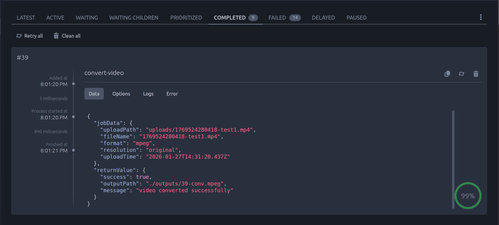

# Distributed Video Pipeline



Async video conversion backend using message queues. API accepts uploads and responds immediately while workers process conversions in background.

## Architecture

```
Client → API Server → Redis Queue → Worker → FFmpeg
         (Producer)                (Consumer)
```

**Flow**: Upload video → Job created → API returns 202 → Worker converts → Status updates

## Tech Stack

- **API**: Express.js
- **Queue**: BullMQ + Redis
- **Worker**: Node.js (child processes)
- **Processing**: FFmpeg

## Setup

```bash
npm install
docker-compose up -d  # Redis
npm run dev:api       # Terminal 1
npm run dev:worker    # Terminal 2
```

## API

**Upload Video**

```bash
curl -X POST http://localhost:3000/api/convert \
  -F "video=@input.mp4" \
  -F "format=mpeg" \
  -F "resolution=720p"
```

**Check Status**

```bash
curl http://localhost:3000/api/jobs/:jobId
```

**Dashboard**  
`http://localhost:3000/admin/queues`

## Features

- **Job States**: `waiting → active → completed/failed`
- **Retries**: 3 attempts with exponential backoff
- **Idempotency**: Duplicate uploads detected via file hash
- **Progress Tracking**: Real-time percentage updates
- **Concurrency**: 2 jobs per worker (scalable)
- **File Cleanup**: Auto-delete inputs after conversion
- **Graceful Shutdown**: Workers finish current jobs before exit

## Job Lifecycle

1. Client uploads video
2. API creates job in Redis, returns jobId (202 Accepted)
3. Worker picks up job from queue
4. FFmpeg converts video, worker updates progress
5. Job marked completed, input file deleted
6. Failed jobs retry 3x, then moved to failed queue

## Scaling

Run multiple workers:

```bash
npm run dev:worker  # Terminal 1
npm run dev:worker  # Terminal 2
npm run dev:worker  # Terminal 3
```

Each worker processes 2 jobs concurrently = 6 total parallel conversions.
